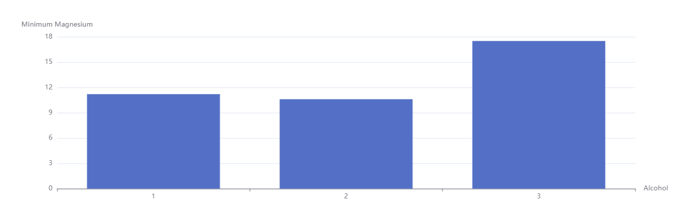

# Please Follow Below steps to get started

## After cloning the repos

```bash
  cd solvative-assignment
```

Install dependencies

```bash
  yarn install
```

Start the server

```bash
  yarn dev
```

## Screenshots




